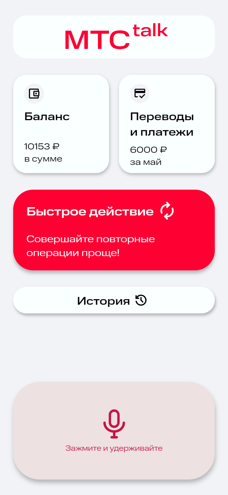
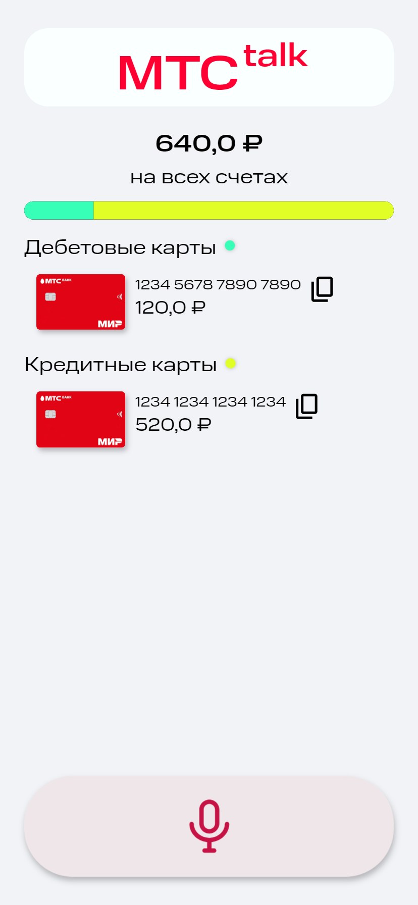
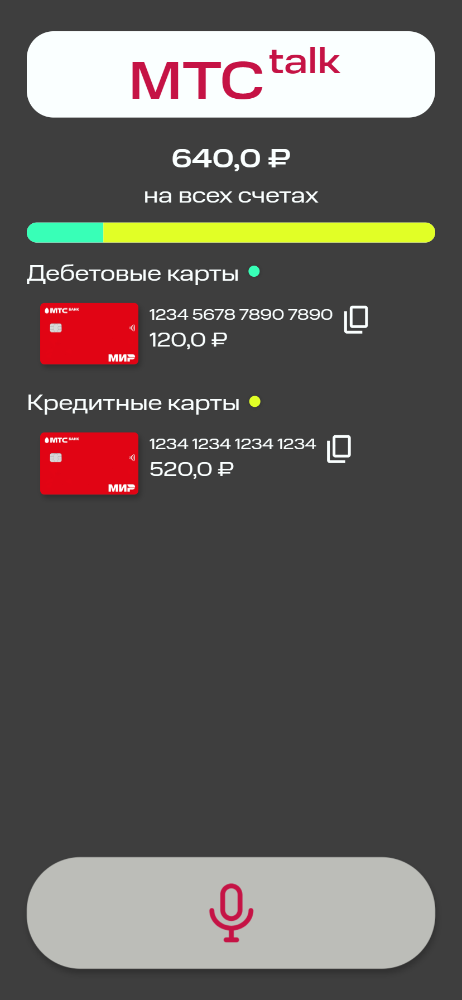
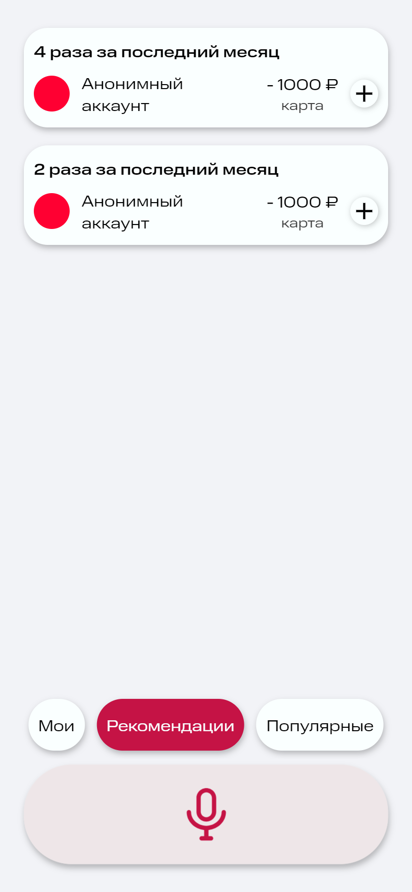
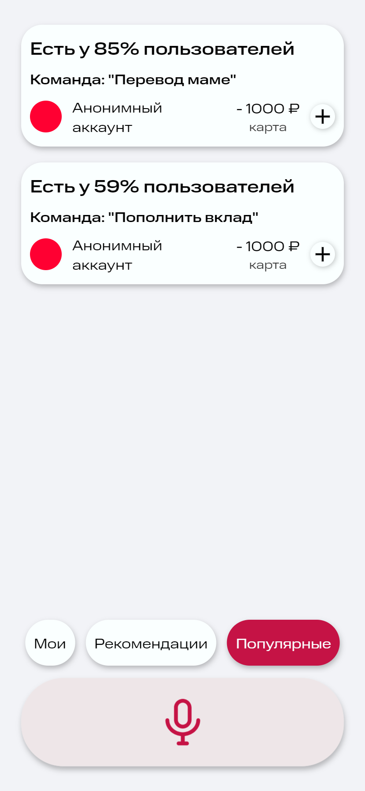
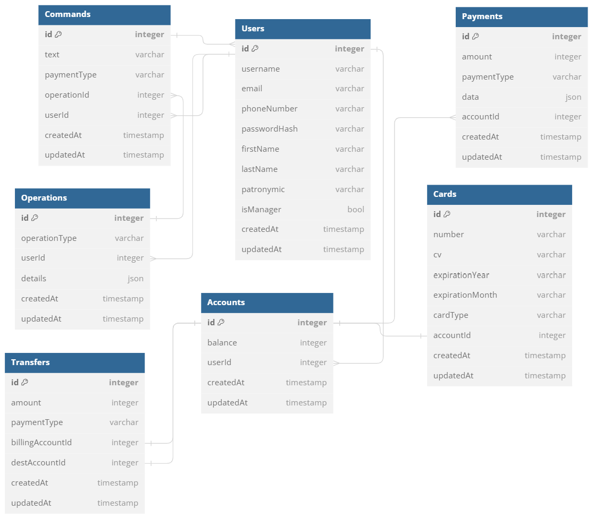

# MTS-Talk

*Простой сервис с поддержкой голосового управления, предлагающий удобные шаблоны для банковских операций*

## Инструкция по установке

0. Для запуска необходимо наличие Docker

1. Клонирование репозитория
```
git clone git.codenrock.com/true-tech-hack-1150/cnrprod1714204656-team-69319/true-tech-hack-fintech.git
```

2. Запуск приложения
```
make dev
```
*При отсутствии make сработает следующая команда:*
```
docker-compose -f ./docker-compose.dev.yml up -d --build
```

При этом запускается фронтенд на http://localhost:3001, бэкенд на http://localhost:5001, микросервис взаимодействия с AI на http://localhost:5002, pgAdmin4 на http://localhost:5051. Документацию OpenAPI можно найти по http://localhost:5001/api для бэкенда и по http://locahost:5002 для микросервиса.

3. Открытие приложения
*Приложение доступно в браузере по адресу http://localhost:3001, рекомендуется использовать Google Chrome*


4. Остановка приложения
```
make dev-down
```

## Стек используемых технологий
 Web - приложение было разработано на Typescript, а для взаимодействия с Ai интерфейсами использовался python. Бэкенд написан на NestJS, а на клиент на библиотеке React с расширениями ReduxToolkit и RTKQuery с применением aria-атрибутов. Было использовано API OpenAI для распознавания команд банковских операций.


## Результат

 Итоговое приложение содержит несколько представлений, содержащих небольшое число визуальных составляющих, что облегчает работу со screen-reader программами


 
Приложение было спроектировано с возможностью добавления разных цветовых тем и их динамическим изменением





Основные функции приложения реализованы на странице действий. Пользователь может добавлять краткие команды для операций. Также мы предлагаем пользователю несколько команд, популярных, согласно общей банковской статистике, а также команды, подходящие конкретному пользователю.

Примерные команды для тестирования (для голосового управления необходимо зажать большую кнопку с микрофоном внизу приложения):

* Какой у меня общий баланс? 
* Какой у меня баланс на карте, оканчивающейся на 1234? 
* Какой у меня баланс на дебетовой карте? 
* Переведи 1000 рублей по номеру телефона +79999999999




## CJM 

Пользователя, испытывающего сложности во время обычного сценария взаимодействия с банком, порадует облегчённое выполнение рутинных операций. После разового запоминания команд, дальнейшая работа с приложением станет быстрее и проще, что, как мы надеемся, заставит пользователя отдавать нашему приложению предпочтение.


## Структура базы данных




## Предложения по масштабированию

1. Архитектура приложения была спроектирована с возможностью простой интеграции других решений в области AI, что даёт возможность в будущем использовать любую подходящую технологию для работы с речью.

2. Серверная часть приложения предполагает простое расширение имеющихся сущностей и добавление новых благодаря модульной структуре фреймворка NestJS, что позволит использовать команды не только для переводов, оплаты счетов, но и других банковских операций.

3. Клиентская часть, благодаря работе с RTKQuery, имеет возможность быстро принять новые данные о статистике и возможностях удобных команд. Опция смены темы предлагает наиболее удобный опыт для людей с самыми разными особенностями зрения.


## Тестовые данные
*При инициализации приложения генерируются следующие фикстуры (начальные данные для первой работы с приложением)*

Пользователь 1:
```
{
  username: "test1",
  pwd: "test",
  firstName: "Лев",
  lastName: "Антипов",
  patronymic: "Валерьевич",
  phone: "+79050170888",
  email: "test1@gmail.com",
  isManager: true
}
```
Данные банковских карт пользователя 1:
```
[{
  expirationMonth: "09",
  expirationYear: "2025",
  cardType: 'debit,
  balance: 2500000,
  number: "5689123456431234",
  cv: "212"
},
{
  expirationMonth: "08",
  expirationYear: "2025",
  cardType: 'credit',
  balance: 2500000,
  number: "5689123456431235",
  cv: "121"
}]
```

Пользователь 2:
```
{
  username: "test2",
  pwd: "test",
  firstName: "Андрей",
  lastName: "Наместников",
  patronymic: "Евгеньевич",
  phone: "+79050170881",
  email: "test2@gmail.com",
  isManager: true
}
```
Данные банковских карт пользователя 2:
```
[{
  expirationMonth: "09",
  expirationYear: "2025",
  cardType: 'debit',
  balance: 2600000,
  number: "5689123856431234",
  cv: "212"
},
{
  expirationMonth: "05",
  expirationYear: "2025",
  cardType: 'credit',
  balance: 2600000,
  number: "5689123456431231",
  cv: "121"
}]
```
